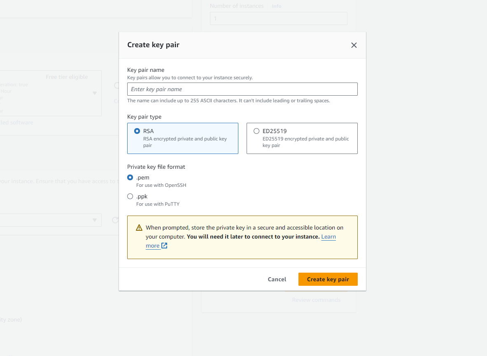

# Architecture Ref.Card 02 - React Application (serverless)

Link zur Übersicht<br/>
https://gitlab.com/bbwrl/m346-ref-card-overview

## Installation der benötigten Werkzeuge

Für das Bauen der App wird Node bzw. npm benötigt. Die Tools sind unter
der folgenden URL zu finden. Für die meisten Benutzer:innen empfiehlt sich
die LTS Version.<br/>
https://nodejs.org/en/download/

Node Version Manager<br/>
Für erfahren Benutzer:innen empfiehlt sich die Installation des
Node Version Manager nvm. Dieses Tool erlaubt das Installiert und das
Wechseln der Node Version über die Kommandozeile.<br/>
**Achtung: Node darf noch nicht auf dem Computer installiert sein.**<br/>
https://learn2torials.com/a/how-to-install-nvm

## Inbetriebnahme auf eigenem Computer

Projekt herunterladen<br/>
```git clone git@gitlab.com:bbwrl/m346-ref-card-02.git```
<br/>
```cd architecture-refcard-02```

### Projekt bauen und starten

Die Ausführung der Befehle erfolgt im Projektordner

Builden mit Node/npm<br/>
```$ npm install```

Das Projekt wird gebaut und die entsprechenden Dateien unter dem Ordner node_modules gespeichert.

Die App kann nun mit folgendem Befehl gestartet werden<br/>
```$ npm start```

Die App kann nun im Browser unter der URL http://localhost:3000 betrachtet werden.

### Inbetriebnahme mit Docker Container

1. **Create a `Dockerfile`:**

   Dockerfile

   ```
   FROM node:18-alpine
   WORKDIR /app
   COPY package*.json ./
   RUN npm install
   COPY . .
   EXPOSE 3000
   CMD ["npm", "start"]

   ```


2. **Build and push the Docker image:**

   Bash

   ```
   docker build -t  galaxy444/m346-ref-card-liam-gleeson .
   docker push  galaxy444/m346-ref-card-liam-gleeson

   ```

### **Configure GitHub Actions:**

1. **Create a `.github/workflows/ci.yml` file:**

   YAML

   ```
   name: CI

   on:
     push:
       branches: [ main ]

   jobs:
     build:
       runs-on: ubuntu-latest

       steps:
       - uses: actions/checkout@v3
       - name: Build the Docker image
         run: docker build -t galaxy444/m346-ref-card-liam-gleeson .
       - name: Log in to Docker Hub
         run: docker login -u $DOCKER_USERNAME -p $DOCKER_PASSWORD
       - name: Push the Docker image
         run: docker push galaxy444/m346-ref-card-liam-gleeson

   ```


2. **Add Docker Hub credentials as secrets:**

    - Create secrets in your GitHub repository settings.
    - Image of dockerhub: 

### **Conclusion:**

I made the pipeline build and then update it on my docker account, for this to work I needed a personal access token (
POT), after I got this i set the repo secret to that value

# Build and Deploy Docker to AWS

This repository contains a GitHub Actions workflow to automate the process of building a Docker image and deploying it
to an Amazon Web Services (AWS) Elastic Container Registry (ECR) and EC2 instance.

## Workflow Overview

The workflow is triggered on a push to the `main` branch and consists of two main jobs: **build** and **deploy**.

### 1. Build Job

- **Runs on**: `ubuntu-latest`
- **Steps**:
    1. **Checkout Code**: Retrieves the code from the repository.
    2. **Set Up AWS Credentials**: Configures AWS CLI with credentials stored in GitHub Secrets.
    3. **Log in to Amazon ECR**: Authenticates the Docker client to the Amazon ECR service.
    4. **Build Docker Image**: Builds the Docker image from the Dockerfile in the repository.
    5. **Tag Docker Image**: Tags the built Docker image for ECR.
    6. **Push Docker Image to Amazon ECR**: Pushes the tagged Docker image to ECR.
- Afterwards it will be sent to ecr and should look like this:
- Image of dockerhub: 

### 2. Create EC2 instance

- Enter name:
- Image of enter name: 
- Afterwards choose ubuntu, then leave everything as it is
- Generate new key pair: 
- then copy the file contents and add them to the secrets

### 3. Deploy Job

- **Depends on**: `build`
- **Runs on**: `ubuntu-latest`
- **Steps**:
    1. **Copy PEM File**: Saves the private key for SSH access to the EC2 instance.
    2. **Deploy Docker Image to EC2**: Connects to the EC2 instance via SSH to:
        - Update the package list.
        - Install Docker and AWS CLI.
        - Authenticate with ECR.
        - Pull the Docker image.
        - Stop and remove any existing containers.
        - Run the new Docker container.

    - Now it will run on the ec2 and be accesible

## Prerequisites

- **AWS Account**: Ensure you have an AWS account with permissions to access ECR and EC2.
- **GitHub Secrets**: Set up the following secrets in your GitHub repository:
    - `AWS_ACCESS_KEY_ID`: Your AWS access key ID.
    - `AWS_SECRET_ACCESS_KEY`: Your AWS secret access key.
    - `AWS_SESSION_TOKEN`: Your AWS session token (if required).
    - `AWS_REGION`: Your desired AWS region (e.g., `us-east-1`).
    - `ECR_REPOSITORY`: The full URI of your ECR repository (
      e.g., `123456789012.dkr.ecr.us-east-1.amazonaws.com/my-docker-app`).
    - `EC2_SSH_PRIVATE_KEY`: Your EC2 instance's private SSH key.

## Deployment Steps

1. Push your changes to the `main` branch.
2. The workflow will automatically trigger, building the Docker image and deploying it to the EC2 instance.

## Important Notes

- Ensure the EC2 instance is running and accessible.
- Modify the `EC2_INSTANCE_DNS` variable in the `deploy` job to reflect your instance's DNS name.
- The workflow assumes the Docker container listens on port 80. Modify the port mapping as needed.

## Troubleshooting

- Check the Actions tab in your GitHub repository for logs and details on any failures.
- Ensure that the IAM role associated with your AWS credentials has the necessary permissions for ECR and EC2 actions.
